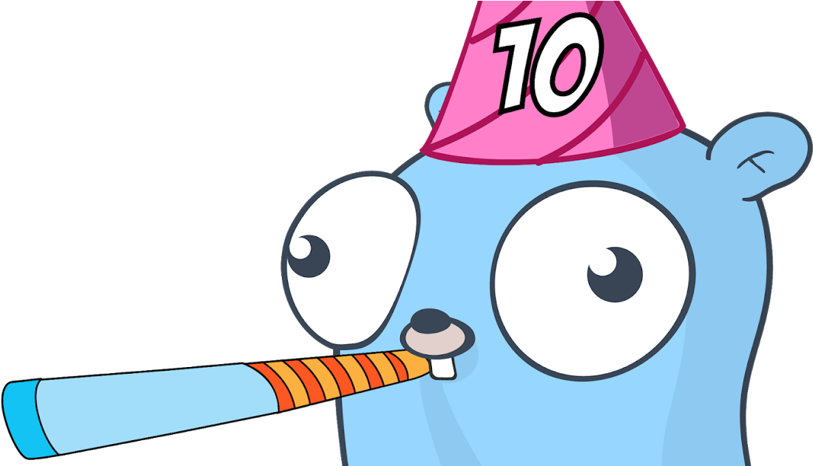
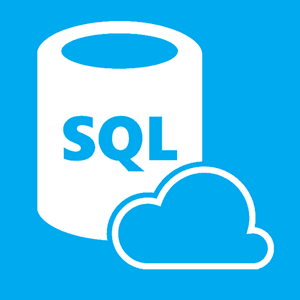
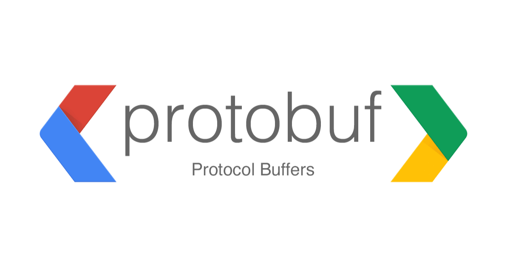
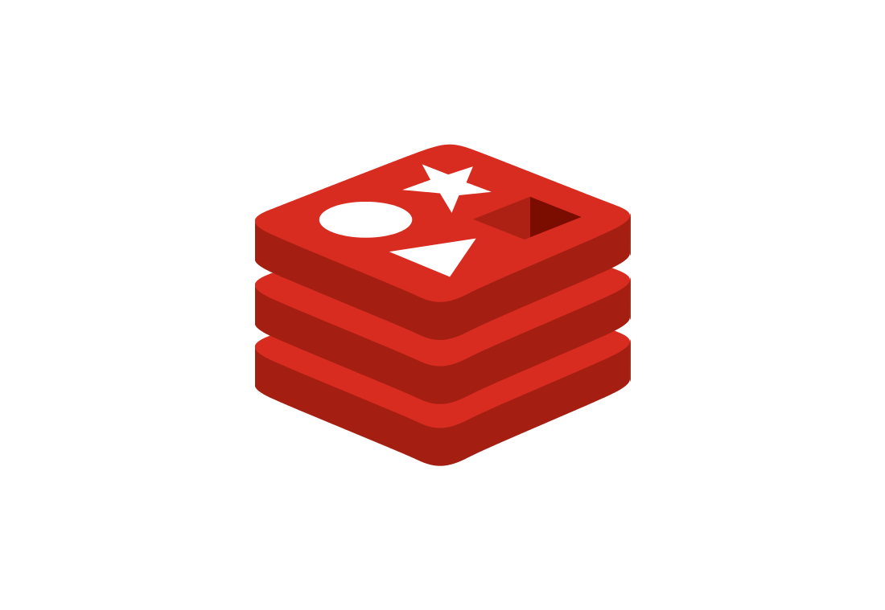
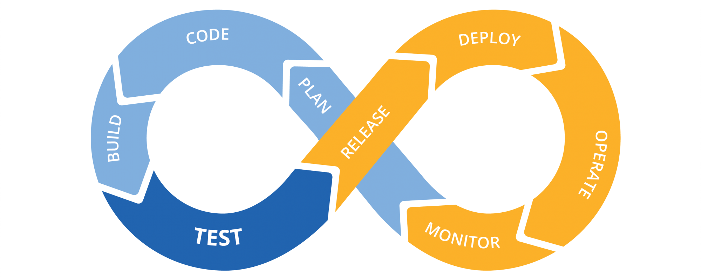

## About
- 👋 Hi, I’m Rishat Ishbulatov aka @brie3 junior golang developer 
recently graduated from geekbrains go development department.
Looking for a job as a backend developer.
- 👀 I’m interested in golang, react, svelte.
- 🌱 I’m currently learning backend production best practicies. 
- 💞️ I’m looking to collaborate on apps that help people to improve and spend less time on boring stuff.
- 📫 You can reach me via email b3r6i9@gmail.com

### Hard Skills:

